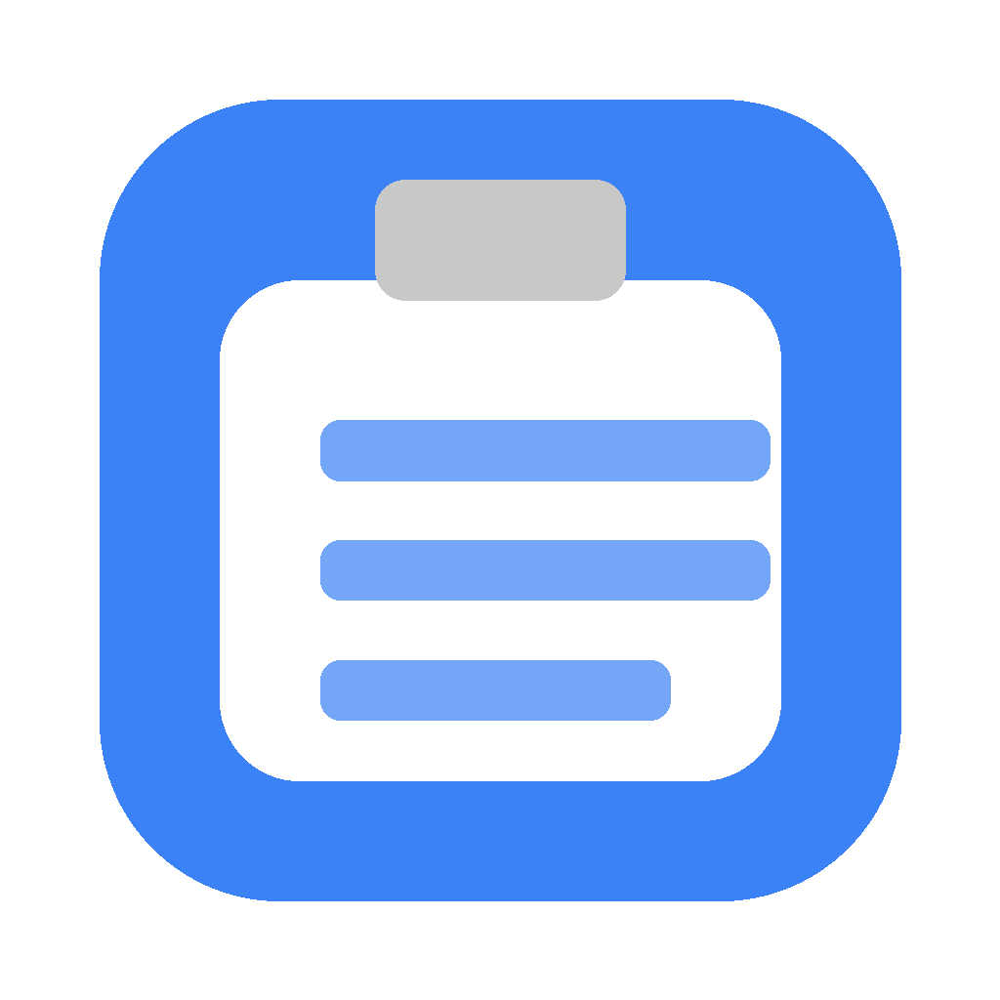

<p align="center">
  
</p>

<h1 align="center">ClipShelf</h1>

<p align="center">
  macOS menu bar clipboard history.<br>
  Rules on copy · app-aware paste · local search
</p>

<p align="center">
  <a href="README_CN.md">中文文档</a>
</p>

---

## What it does

ClipShelf keeps a searchable history of what you copy, and applies optional rules before items are stored. When you paste from history, it can adjust formatting for the app you are pasting into.

It is a local utility. No account is required. History stays on this Mac.

## Features

### Clipboard history
- Text, rich text, images, and file paths
- Pin important items
- Fuzzy search and full-text search (SQLite FTS)
- Hot/cold loading so large histories stay responsive

### Rules on copy
- Strip common URL tracking parameters
- Flag sensitive content (cards, API keys, private keys) with optional expiry
- Custom rules: regex, source app, content type, or sandboxed JavaScript

### App-aware paste
- Adjusts format for common targets (editors, terminals, notes, messaging, email)
- Optional paste queue for sequential pastes

### Other
- Menu bar app with global hotkey (`⌘⇧V` by default)
- OCR for images (on-device Vision)
- Snippet expansion
- Import / export
- Chinese and English UI

## Install

### Homebrew

```bash
brew install --cask clipshelf
```

### From source

Requires macOS 13+, Xcode 15+, [XcodeGen](https://github.com/yonaskolb/XcodeGen).

```bash
git clone https://github.com/shiaho777/clipshelf.git
cd clipshelf
xcodegen generate
xcodebuild -scheme ClipShelf -configuration Release build
```

## Usage

1. Launch ClipShelf — it appears in the menu bar
2. Copy as usual — items are stored in history
3. Press `⌘⇧V` to open the panel, search, and paste
4. Grant Accessibility when prompted (needed to simulate paste)


## Privacy

- History is stored locally under `~/Library/Application Support/ClipShelf/`
- On first launch after rename, data is moved from the legacy `ClipboardManager` folder when needed
- Password managers are excluded by default
- Sensitive items can auto-expire
- No telemetry

## Development layout

```
Sources/
├── main.swift                    # App entry, panel, hotkeys
├── ClipboardManager.swift        # History facade / coordination
├── ClipboardMonitor.swift        # Pasteboard polling
├── ClipboardRuleEngine.swift     # Rules on capture
├── PasteAdapter.swift            # App-aware paste adapters
├── SQLiteHistoryStore.swift      # Persistence + FTS
├── MenuBarView.swift             # Main UI
└── ...
```

```bash
xcodegen generate
xcodebuild test -scheme ClipShelf -destination 'platform=macOS'
```

## License

MIT — see [LICENSE](LICENSE).
