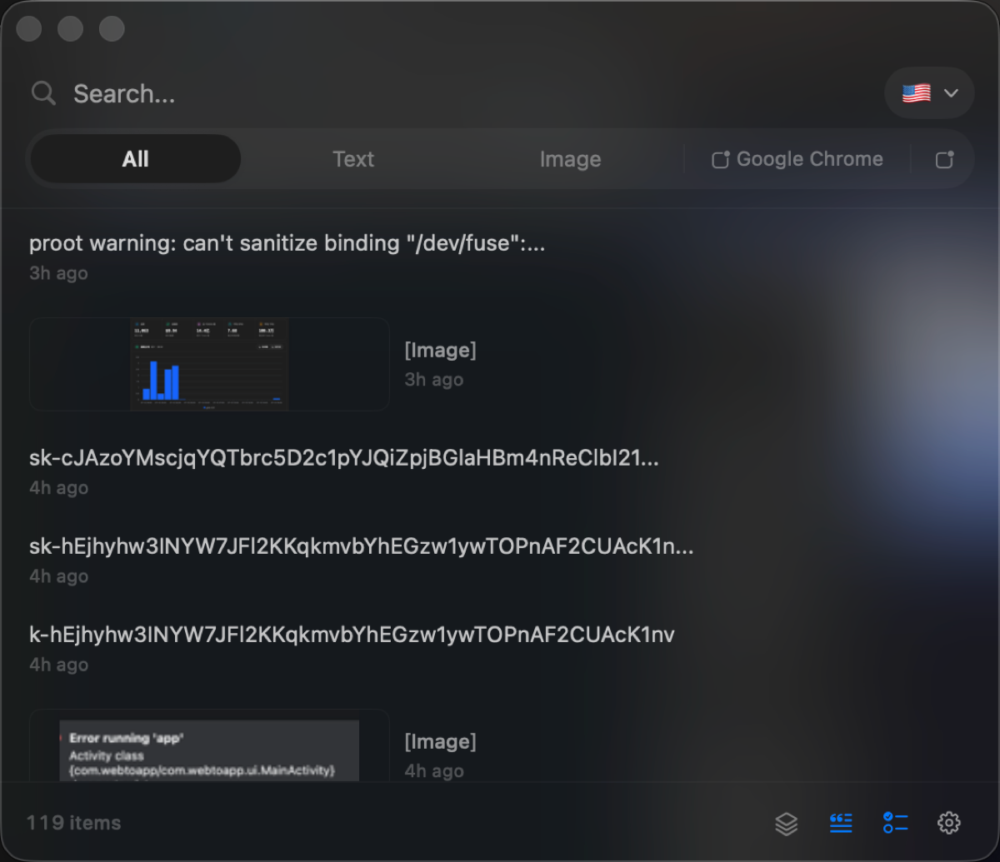

# ClipShelf

<p align="center">
  macOS 菜单栏剪贴板历史。<br>
  复制时处理 · 按应用适配粘贴 · 本地可搜
</p>

[English](README.md)

---

<p align="center">
  
</p>


## 它做什么

ClipShelf 保存可搜索的剪贴板历史，并在入库前可选地运行规则。从历史粘贴时，可按当前目标应用调整格式。

本地工具，无需账号。历史只保存在本机。

## 功能

### 剪贴板历史
- 文本、富文本、图片、文件路径
- 置顶
- 模糊搜索与全文搜索（SQLite FTS）
- 热/冷分层加载，历史量大时仍保持响应

### 复制时规则
- 去除常见 URL 追踪参数
- 标记敏感内容（银行卡、API Key、私钥等），可设过期
- 自定义规则：正则、来源应用、内容类型，或沙箱 JavaScript

### 按应用适配粘贴
- 针对常见编辑器、终端、笔记、通讯、邮件等调整格式
- 可选粘贴队列，按顺序粘贴

### 其它
- 菜单栏应用，默认全局快捷键 `⌘⇧V`
- 图片 OCR（设备端 Vision）
- Snippet 文本扩展
- 导入 / 导出
- 中英文界面

## 安装

从最新 [GitHub Release](https://github.com/shiaho777/clipshelf/releases/latest) 下载 DMG。

1. 打开 DMG，将 **ClipShelf** 拖到 **应用程序**
2. 启动 ClipShelf

若提示**已损坏**，在终端执行：

```bash
xattr -cr /Applications/ClipShelf.app
```

然后再打开。需要 macOS 13+。


## 使用

1. 启动 ClipShelf — 图标出现在菜单栏
2. 正常复制 — 内容进入历史
3. 按 `⌘⇧V` 打开面板，搜索并粘贴
4. 按提示授予辅助功能权限（用于模拟粘贴）

## 隐私

- 历史只保存在本机（`~/Library/Application Support/ClipShelf/`）
- 无账号、无云同步、无遥测
- 默认排除密码管理器

若系统拦截或提示已损坏，是下载带来的本地隔离属性，不是远程访问。用上面的 `xattr` 命令清除即可。


## 开发

需要 macOS 13+、Xcode 15+、[XcodeGen](https://github.com/yonaskolb/XcodeGen)。

```bash
git clone https://github.com/shiaho777/clipshelf.git
cd clipshelf
xcodegen generate
xcodebuild -scheme ClipShelf -configuration Release build
xcodebuild test -scheme ClipShelf -destination 'platform=macOS'
```

## 许可证

MIT — 见 [LICENSE](LICENSE)。
